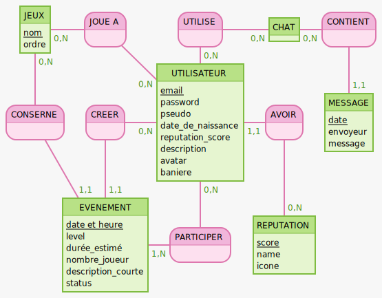

# Cahier des charges:

## Présentation du projet:

Une application qui permet de trouver rapidement et facilement d'autres joueurs de son niveau souhaitant jouer au même jeu que vous.

### Objectifs du projets:

Donnez la possibilité a des joueur d'entrer en contact via la création ou la participation à des évenements, afin de jouer à leur jeux favoris ensemble.

### Définition du MVP (Minimum Viable Product):

- compte utilisateur (inscription, connection)
- gestion du profil
  - listing des évenement et ajout de jeux avec lien via l'API de ces derniers
- création d'évenement
- recherche et consultation d'évenement
- chat 
  - message entre deux utilisateur
  - messagerie d'evenement  
- pages de jeux (une pages pour chaque jeux avec informations et dernier évenements)
  - Jeux pris en charges V0 :
    - League of Legend
    - Counter Strike Global Offensive
    - VALORANT
    - Fornite
    - Call of Duty
    - GTA online
    - DOTA II  
    - Rocket League
    - starcraft II
    - Apex
    - Overwacth
    - PUBG 
    - escape from Tarkov

### Décrire les fonctionnalités (specs fonctionelles):

- Gestion de compte :
  - Connexion, déconnexion, inscription  
- Gestion de profil:
  - pseudo ,Avatar , déscription, jeux, rang réputation,  récupération des statistics du joueur via les API des jeux
- Recherche:
  - Recherche d'évenement ou éventuellement de joueurs
- Messagerie: 
  - Chat entre joueur 
  - Chat d'évenement
- Page jeu:
  - Affichage des news du jeu, ainsi qu'une vue des joueurs / prochain évenement sur ce jeu

### Lister les technos choisies (specs techniques) (penser à justifier le choix):

- React
- (Redux)
- Mongodb(api)
- Postgres (user db)
- Sqitch
- NodeJS
- Express
- Sass

### Décrire les rôles de chacun (Prénom NOM : Rôle):

- Guillaume Marenghi : Product Owner, Réferents techniques back
- Fred Ihuel: Scrum Master, Réferents techniques front  
- Mehdi Rabelle: Lead dev front
- Luc Georges: Lead dev back, Git Master

### Décrire le public visé (cible):

les joueurs de tout age et de tout niveaux cherchant des team mates

### Pontentielles évolutions:

- Donner la possibilité de créer des Evènements globaux
- création de tournois
- Matching:
  - Proposition d'évenement correspondant à un évenement créer par la joueur
- systeme de team
- systeme d'ajout d'"amis"

### Arborescence de l'application:

### Lister les routes:

- Accueil
- Se connecter / s'enregistrer
- Profil
- Recherche de mate / jeux 

### Wireframes:

- Version mobile + desktop

### Maquettes graphique non obligatoires:

### Docs de conception de la BDD

- MCD (modèle conceptuel de données -> entités) https://github.com/O-clock-Alumni/fiches-recap/blob/master/bdd/conception-03-mcd.md
- Dictionnaire de données
- MLD (modèle logique de données -> tables) Non obligatoire
- User stories (qui serviront par exemple pour le trello)  
  
| En tant que | je peut | dans le but de |
| ----------- | ------| --------------|
| Visiteur | créer un compte | acceder aux fonctionnalités de l'app |
| Utilisateur | me connecter/deconnecter ||
| Utilisateur | créer un evenement| trouver d'autre joueur|
| Utilisateur | acceder aux profil des autres joueurs | me renseigner sur leur information et/ou leur envoyer un message|
| Utilisateur | rechercher un évenement | trouver des mates avec qui jouer |
| Utilisateur | postuler a un evenement | participêer a celui ci |
| Utilisateur | utiliser un chat | communiquer avec les autres joueur |
| Utilisateur | ajouter ou enlever 1 point de reputation a un autre utilisateur | recommander ou inversement le joueur en question |
| Utilisateur | editer mon profil | inserer/changer des informations |
| Utilisateur | contacter les admin du site | de leur dire des mots doux |
| Createur d'évenement | accepter un joueur | jouer avec celui ci |
| Createur d'évenement | decline une demande d'ajout | ne pas jouer avec ce joueur |
| Createur d'évenement | chater avec les participants | |

#### MCD

#### MLD

USER (id, email, password, nickname, date_of_birth, reputation_score, description, avatar, banner)  
EVENT (id, timestamp, level, duration, player_count, description, status, user_id, game_id)  
GAME (id, order)  
REPUTATION (id, score, name, ico)  
CHAT (id)  
MESSAGE (id, date, sender, message)  
M_2_M_USER_has_GAME (id, game_id, user_id, id_for_API)  
M_2_M_USER_has_EVENT (id, event_id, user_id, status)  
M_2_M_USER_has_CHAT (id, chat_id, user_id)  
