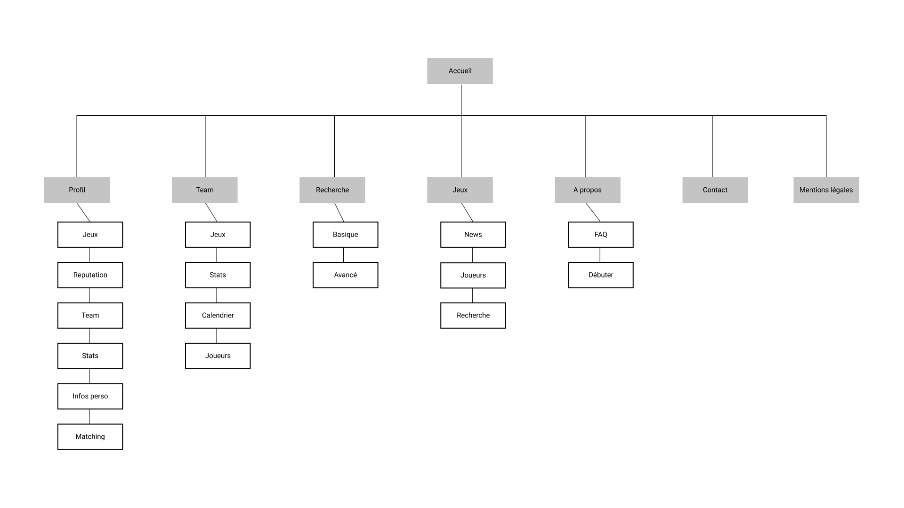

# Cahier des charges:

## Présentation du projet:

Une application qui permet de trouver rapidement et facilement d'autres joueurs de son niveau souhaitant jouer au même jeu que vous.

### Objectifs du projets:

Donner la possibilité à des communautés de joueurs de se créer, notamment en se donnant RdV pour jouer ensemble, de manière régulière ou pas, et en discutant via un système de messagerie instantané.

### Définition du MVP (Minimum Viable Product):

- Connection au site
- Creation d'un profil avec la possibilité de paramétrer le niveau du joueur dans chaque jeux séparément
- Recherche de joueurs en filtrant par jeux et "rang" dans le jeu
- Proposition de joueurs par "match"
- Récupération des statistique du joueur via l'api des différent jeux si accessible
- Possibilité de creation d'une team de 2 a X joueurs 
- Accès a un "Hub" de la team pour proposer des évènements à l'aide d'un calendrier

### Décrire les fonctionnalités (specs fonctionelles):

- Gestion de compte :
  - Connexion, déconnexion, inscription  
- Gestion de profil:
  - pseudo ,Avatar , déscription, jeux, rang réputation, list des teams, récupération des statistics du joueur
- Recherche:
  - Recherche de joueurs ou de team (basic ou avancé (age, niveaux ...))
- Matching:
  - Proposition de joueurs ou de team ayant un profil similaire
- Messagerie: 
  - Type chat entre joueur (pm) ou global (team)
- Page jeu:
  - Affichage des news du jeu, ainsi qu'une vue des joueurs / team actif sur ce jeu
- Teams: 
  - Creation de team (nom, description, avatar), gestion des joueurs, Calendrier de disponibilité et d'évènement 

### Lister les technos choisies (specs techniques) (penser à justifier le choix):

- React
- Redux
- Mongodb(api)
- Postgres (user db)
- Sqitch
- NodeJS
- Express
- Sass

### Décrire les rôles de chacun (Prénom NOM : Rôle):

- Guillaume Marenghi : Product Owner, Réferents techniques back
- Fred Ihuel: Scrum Master, Réferents techniques front  
- Mehdi Rabelle: Lead dev front
- Luc Georges: Lead dev back, Git Master

### Décrire le public visé (cible):

les joueurs de tout age et de tout niveaux cherchant des team mate

### Pontentielles évolutions:

- Donner la possibilité de créer des Evènements globaux
- création de droit de modération pour les teams (inviter des joueurs, kicker des joueurs)
- proposition de matching de joueur pour la team

### Arborescence de l'application:

### Lister les routes:

- Accueil
- Se connecter / s'enregistrer
- Profil
- Team
- Recherche de mate / jeux 

### Wireframes:

- Version mobile + desktop

### Maquettes graphique non obligatoires:

### Docs de conception de la BDD
- MCD (modèle conceptuel de données -> entités) https://github.com/O-clock-Alumni/fiches-recap/blob/master/bdd/conception-03-mcd.md
- Dictionnaire de données
- MLD (modèle logique de données -> tables) Non obligatoire
- User stories (qui serviront par exemple pour le trello)
  