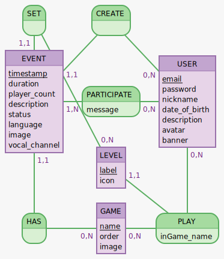

# Cahier des charges:

## Présentation du projet:

Une application qui permet de trouver rapidement et facilement d'autres joueurs de son niveau souhaitant jouer au même jeu que vous.

### Objectifs du projets:

Donnez la possibilité à des joueurs d'entrer en contact via la création ou la participation à des évenements, afin de jouer à leur jeux favoris ensemble.

### Définition du MVP (Minimum Viable Product):

- Compte utilisateur (inscription, connection)
- Gestion du profil
  - Listing des évenement et ajout de jeux avec lien (compte joueur) via l'API de ces derniers
- Création d'évenement
- Recherche et consultation d'évenement
- Pages de jeux (une page par jeux)
  - Informations et derniers évenements
  - Jeux pris en charges V1 :
    - League of Legend 

### Décrire les fonctionnalités (specs fonctionelles):

- Gestion de compte:
  - Connexion, déconnexion, inscription  
- Gestion de profil:
  - Pseudo, avatar, description, jeux, rang, réputation,  récupération des statistiques du joueur via les API des jeux
- Recherche:
  - Recherche par nom de joueur
  - Filtre de recherche:
    - Jeux, date / heure, nombre de joueurs, durée estimé,  langue(s)
- Création d'évènements:
  - A renseigner:
    - Jeux, miniature du jeux, date / heure, nombre de joueurs, durée estimé,  langue(s), description
- Messagerie: 
  - Chat entre deux joueurs
  - Chat d'évenement
- Page jeu:
  - Affichage des news du jeu, ainsi qu'une vue des joueurs / prochain évenement sur ce jeu

### Lister les technos choisies (specs techniques) (penser à justifier le choix):

- React
- Redux
- Sass
- (Redis)
- Mongodb(api)
- Postgres (user db)
- Sqitch
- NodeJS
- Express

### Décrire les rôles de chacun (Prénom NOM : Rôle):

- Guillaume Marenghi : Product Owner, Réferents techniques back
- Fred Ihuel: Scrum Master, Réferents techniques front  
- Mehdi Rabelle: Lead dev front
- Luc Georges: Lead dev back, Git Master

### Décrire le public visé (cible):

les joueurs de tout age et de tout niveaux cherchant des team mates

### Pontentielles évolutions:

- Ajout de jeux
  - Fornite v1.1
  - Counter Strike Global Offensive v1.2
  - VALORANT v1.2
  - Call of Duty v2
  - GTA online v2
  - DOTA II  v2
  - Rocket League v2
  - starcraft II v2
  - Apex v2
  - Overwacth v2
  - PUBG v2
  - escape from Tarkov v2
- ajout d'un systeme de réputation v 1.3
- Donner la possibilité de créer des Evènements globaux v2
- création de tournois v3
- Matching: v2
  - Proposition d'évenement correspondant à un évenement créer par la joueur
- systeme de team v3
- systeme d'ajout d'"amis" v3

### Arborescence de l'application:

### Lister les routes:

- Accueil
- Se connecter / s'enregistrer
- Profil
- Recherche de mate / jeux 

### Wireframes:

- Version mobile + desktop

### Maquettes graphique non obligatoires:

### Docs de conception de la BDD

- **User stories** (qui serviront par exemple pour le trello)  

| En tant que | je peut | dans le but de | version |
| ----------- | ------| --------------| ------|
| Visiteur | créer un compte | acceder aux fonctionnalités de l'app | v1 |
| Utilisateur | me connecter/deconnecter || v1 |
| Utilisateur | créer un evenement| trouver d'autre joueur| v1|
| Utilisateur | acceder aux profil des autres joueurs | me renseigner sur leur information | v1 |
| Utilisateur | rechercher un évenement | trouver des mates avec qui jouer | v1 |
| Utilisateur | postuler a un evenement | participêer a celui ci | v1 |
| Utilisateur | utiliser un chat | communiquer avec les autres joueur | v2 |
| Utilisateur | ajouter ou enlever 1 point de reputation a un autre utilisateur | recommander ou inversement le joueur en question | v1.1 |
| Utilisateur | editer mon profil | inserer/changer des informations | v1 |
| Utilisateur | contacter les admin du site | de leur dire des mots doux | v1 |
| Createur d'évenement | accepter un joueur | jouer avec celui ci | v1 |
| Createur d'évenement | decline une demande d'ajout | ne pas jouer avec ce joueur | v1 |
| Createur d'évenement | chater avec les participants | | v2 |

#### MCD

#### MLD

USER (id, email, password, nickname, date_of_birth, description, avatar, banner)  
LEVEL (id, label, game_id)  
EVENT (id, user_id,game_id, timestamp, level_id, duration, player_count, description, status, language, caption, vocal_channel )  
GAME (id, order, caption)  
M_2_M_USER_has_GAME (id, game_id, user_id, level_id, inGame_name)  
M_2_M_USER_has_EVENT (id, event_id, user_id, status)  

#### Dictionnaire de données

- User 
 
  - | champ |  type | contrainte | description | commentaire | 
    | ----- | ----- | ---------- | ----------- | ----------- |
    | email | TEXT | NOT NULL | ... | |
    | password | TEXT | NOT NULL | Mot de passe encrypté | ... |
    | nickname | TEXT | NOT NULL | Pseudo visible sur le site ||
    | date_of_birth | TIMESTAMPTZ | NULLABLE | Date de naissance | Servira à matcher les évènements par age des joueurs |
    | description | TEXT | NULLABLE | Déscription en 280 charactere du joueur | |
    | avatar | PATH | NULLABLE | Photo du profil | Importé ou disponible sur le site |
    | banner | PATH | NULLABLE | Image en banièrre | Importé par l'utilisateur |
    
- Level 
 
  - | champ |  type | contrainte | description | commentaire | 
    | ----- | ----- | ---------- | ----------- | ----------- |
    | label | TEXT | NOT NULL | Nom du rang correspondant au jeu |  |
    | game_id | INT | NOT NULL , FOREIGN KEY | Référence vers l'id du jeux | |
    | icon | PATH | NOT NULL | Image représentant le grade | |

- Event 
 
  - | champ |  type | contrainte | description | commentaire | 
    | ----- | ----- | ---------- | ----------- | ----------- |
    | user_id | INT | NOT NULL, foreign key | Référence vers l'id du créateur de l'évènement | |
    | game_id | INT | NOT NULL, foreign key | Référence vers un jeu de la liste | Définit sur quel jeu se déroulera l'évènement |
    | level_id | INT | NOT NULL, foreign key | Référence vers un niveau | Correspond au système de ranking du jeu |
    | timestamp | TIMESTAMPTZ | NOT NULL | Date :Jour, mois, année + heure, minute |  |
    | duration | INTERVAL | NOT NULL | Durée de l'évènement en heure |  |
    | player_count | INT | NOT NULL | Nombre de participant max de l'évènement |  |
    | description | TEXT | nullable | Déscription de l'évènement |  |
    | status | INT | NOT NULL DEFAULT 0 | Status de la progression de l'évènement | 0 = A venir, 1 = En cours, 2 = Terminé   |
    | language | TEXT | NOT NULL DEFAULT 'EN' | Langue parlé durant l'évènement | Pèrmet de trier suivant les langues parlé par l'utilisatuer |
    | image | PATH | NOT NULL | Chemin vers la miniature de l'évènement |  |
    | vocal_channel | TEXT | NOT NULL | Lien vers le channel vocal renseigné par le créateur de l'évènement |  |

- Game

  - | champ |  type | contrainte | description | commentaire | 
    | ----- | ----- | ---------- | ----------- | ----------- |
    | name | TEXT | NOT NULL | nom du jeu |  |
    | order | INT | NOT NULL | definit l'ordre d'apparition des jeux sur la pages d'acceuil | Sert à faciliter l'affichage pour le front |
    | image | PATH | NOT NULL | icone du jeux | Servira pour la caption des évenèments |

- M_2_M_USER_has_GAME
  - | champ |  type | contrainte | description | commentaire | 
    | ----- | ----- | ---------- | ----------- | ----------- |
    | game_id | INT | NOT NULL FOREIGN KEY | Référence vers l'id d'un jeu |  |
    | user_id | INT | NOT NULL FOREIGN KEY | Référence vers l'id d'un user |  |
    | level_id | INT | NOT NULL FOREIGN KEY | Référence vers l'id d'un level |  |
    | Ingame_name | TEXT | NOT NULL | Pseudo de l'utilisateur en jeu |  |

- M_2_M_USER_has_EVENT
  - | champ |  type | contrainte | description | commentaire | 
    | ----- | ----- | ---------- | ----------- | ----------- |
    | event_id | INT | NOT NULL FOREIGN KEY | Référence vers l'id d'un event |  |
    | user_id | INT | NOT NULL FOREIGN KEY | Référence vers l'id d'un user |  |
    | status | INT | NOT NULL | Status de demande de participation | 0 = En attente ,1 = Accepter, 2 = Refusé |
    | message | text | NOT NULL | Envoie un message de contact au créateur de l'évènement | |  